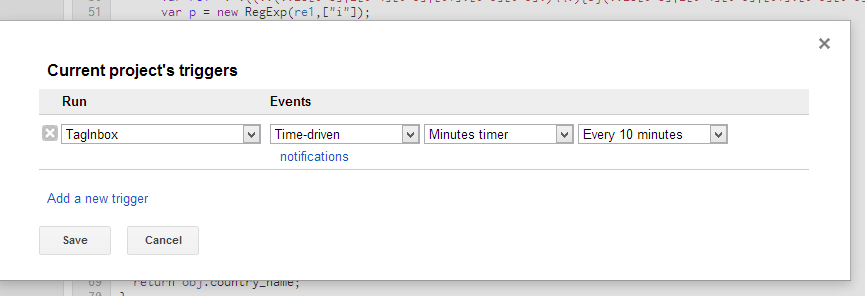

Gmail_GeoIPTagger
=================

An app script that will filter your email from where in the world it was sent from

It labels your email like this: 

**This code is experimental and not feature complete. If it breaks, you get
  to keep both pieces.**

##Setup
First open your google drive and make a new script

Then make a blank project

Copy and paste the contents of `Code.gs` into the code editor

Set your function to run as `TagInbox` and then hit run to make sure it works

The first time that it runs it will ask permissions to read and write to your gmail inbox and to connect to other services

It needs gmail access to tag things as labels, it needs to connect to external services to do GeoIP lookups.

If that runs smoothly we can now set it to run automatically
Resorces > Current Project Triggers

Then set the function to run every 10 mins

